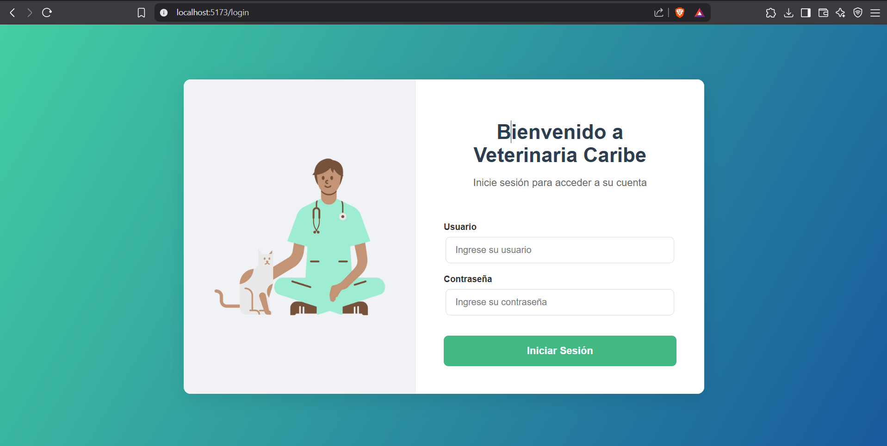
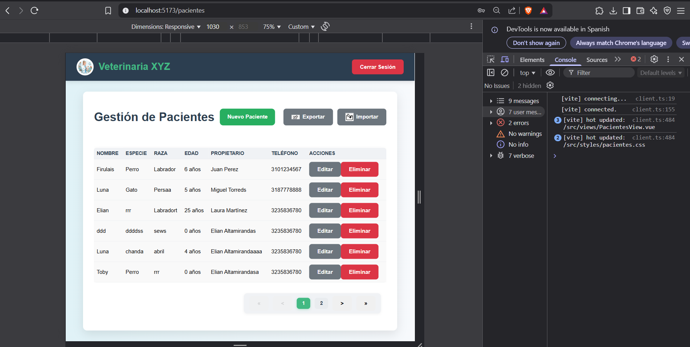
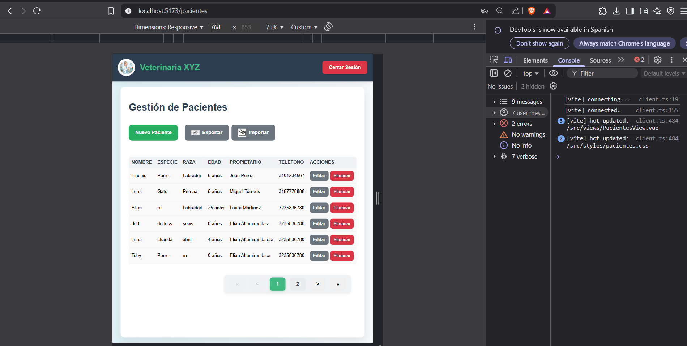
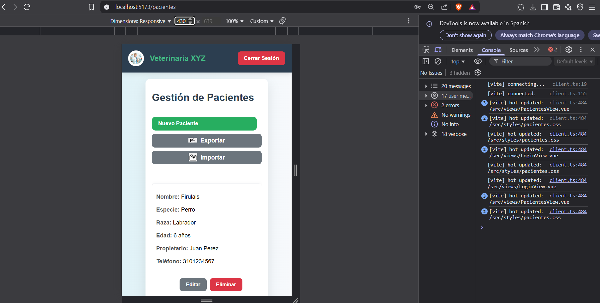
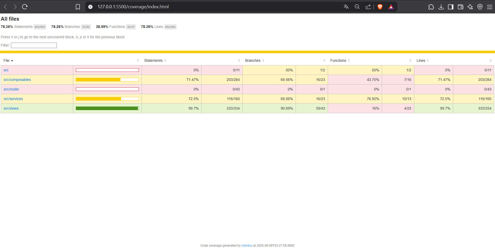

# Gestión de Pacientes Veterinaria XYZ



## Descripción

Este proyecto es una aplicación web para la gestión de pacientes de una veterinaria. Permite registrar, editar, eliminar, importar y exportar pacientes de manera sencilla y visualmente atractiva. El frontend está desarrollado en **Vue.js 3** con **Vite**, y el backend en **Spring Boot**.

---

## Características principales

- **Autenticación segura** (login con feedback visual)
- **Gestión completa de pacientes** (CRUD)
- **Importar y exportar pacientes** (con confirmaciones y notificaciones visuales)
- **Interfaz moderna y responsiva**
- **Alertas y confirmaciones con SweetAlert2**
- **Diseño profesional y coherente**

---

## Tecnologías utilizadas

- [Vue.js 3](https://vuejs.org/)
- [Vite](https://vitejs.dev/)
- [SweetAlert2](https://sweetalert2.github.io/)
- [Spring Boot (backend)](https://spring.io/projects/spring-boot)
- CSS personalizado

---

## Instalación y ejecución

1. **Clona el repositorio:**
   ```bash
   git clone <URL_DEL_REPOSITORIO>
   cd Front-Vue.js
   ```
2. **Instala las dependencias:**
   ```bash
   npm install
   ```
3. **Ejecuta el frontend:**
   ```bash
   npm run dev
   ```
4. **Asegúrate de tener el backend de Spring Boot corriendo** en `http://localhost:8080`.

---

## Estructura del proyecto

```
Front-Vue.js/
├── src/
│   ├── assets/         # Imágenes y recursos
│   ├── components/     # Componentes Vue reutilizables
│   ├── composables/    # Lógica reutilizable (composables Vue)
│   ├── services/       # Servicios para API y autenticación
│   ├── styles/         # Archivos CSS
│   ├── views/          # Vistas principales
│   └── App.vue         # Componente raíz
├── public/
├── package.json
└── README.md
```

---

## Ejemplo visual de responsividad

A continuación se muestran capturas de pantalla de la aplicación en diferentes dispositivos:

### Computador


### Tablet


### Móvil


---

## Ejemplo de la pantalla de inicio


---

## Créditos

Desarrollado por **Elian Altamiranda**

---

## Notas adicionales

- Las imágenes de los botones de importar y exportar se encuentran en `src/assets/exportar.png` y `src/assets/importar.jpg`.
- El diseño es completamente responsivo y se adapta a cualquier dispositivo.
- Para dudas o mejoras, contacta a Elian Altamiranda.

---

## Pruebas unitarias y cobertura

El proyecto cuenta con **tests unitarios** para asegurar la calidad y el correcto funcionamiento de los componentes y la lógica de negocio.

- **Framework de testing:** [Vitest](https://vitest.dev/) (compatible con Vue 3)
- **Cobertura de código:** Se puede visualizar con el comando de cobertura.

### ¿Cómo ejecutar los tests?

```bash
npm run test
```

Para ver la cobertura de código:
```bash
npm run test:coverage
```
Esto generará un reporte visual en la carpeta `coverage/`.

### Ejemplo de reporte de cobertura:



- **Statements:** 78.36%
- **Branches:** 78.26%
- **Functions:** 38.59%
- **Lines:** 78.36%

> El objetivo es mantener y mejorar estos porcentajes para asegurar la robustez del sistema.

### ¿Por qué son importantes los tests?
- Permiten detectar errores antes de que lleguen a producción.
- Facilitan el mantenimiento y la evolución del código.
- Aumentan la confianza al realizar cambios o agregar nuevas funcionalidades.
